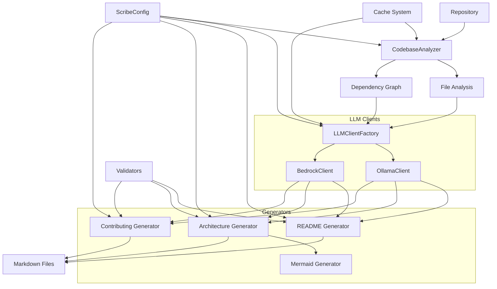
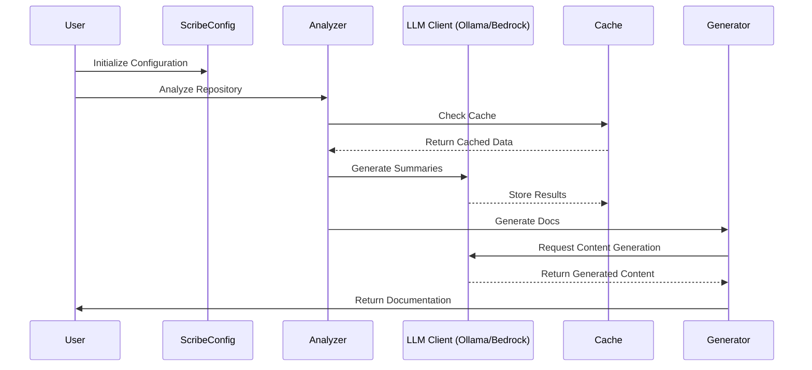
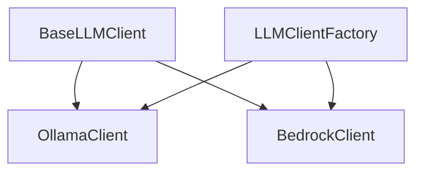
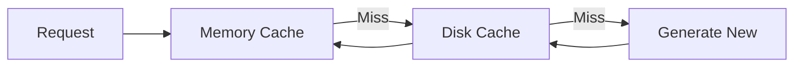
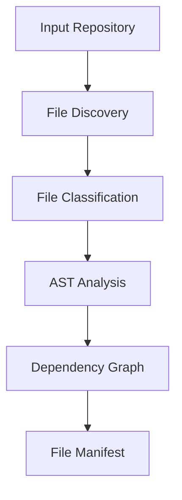
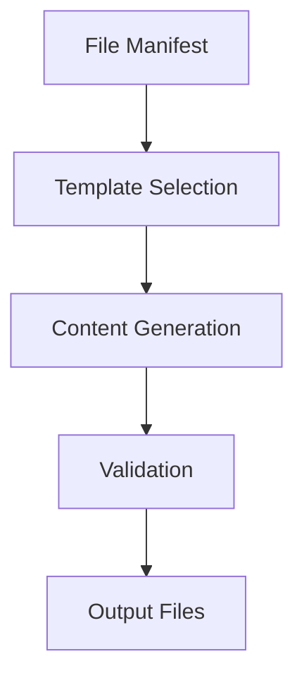
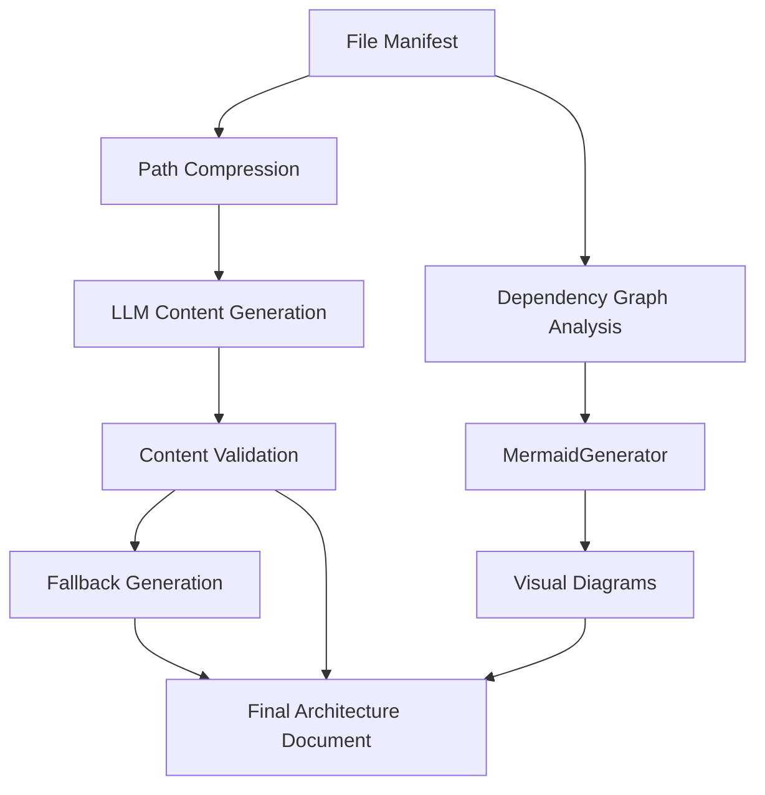

# Architecture Guide

This document provides a detailed overview of the AI README Generator's architecture, design decisions, and system interactions.

## Table of Contents
- [System Overview](#system-overview)
- [Core Components](#core-components)
- [Data Flow](#data-flow)
- [Design Patterns](#design-patterns)
- [Performance Considerations](#performance-considerations)
- [Security](#security)
- [Extensibility](#extensibility)
- [Project Structure](#project-structure)

## System Overview

The codebase-scribe-ai is a comprehensive documentation generation system that analyzes repositories and produces high-quality documentation using AI-powered content generation.

### High-Level Architecture



### Key Components Interaction



### System Process Flow

1. **Repository Analysis**: The CodebaseAnalyzer examines the repository structure, creating a file manifest with metadata for each relevant file.

2. **Configuration Management**: The ScribeConfig class manages all system settings, providing type-safe configuration access to all components.

3. **LLM Provider Selection**: Based on configuration, an appropriate LLM client (Ollama or Bedrock) is selected for AI generation tasks.

4. **Documentation Generation**: Multiple specialized generators create different documentation types:
   - README Generator: Creates project overview documentation
   - Architecture Generator: Creates system architecture documentation with Mermaid diagrams
   - Contributing Generator: Creates contribution guidelines

5. **Diagram Generation**: The Mermaid Generator creates visual representations of code relationships and system architecture.

6. **Cache Management**: A multi-level caching system improves performance by storing analysis results and LLM responses.

7. **Output Validation**: Validators check the generated documentation for quality, completeness, and correctness.

8. **Path Optimization**: The system employs path compression to reduce token usage with LLMs, particularly for deep directory structures.

This architecture provides a flexible, maintainable system that can generate high-quality documentation for a variety of repository types and structures.

## Core Components

### 1. CodebaseAnalyzer
The central component for repository analysis.

#### Responsibilities
- Repository traversal and discovery
- File classification and filtering
- AST parsing and code structure analysis
- Dependency tracking and graph construction
- Import/export detection for various languages
- Project name and metadata derivation
- Markdown validation and structure analysis
- GitIgnore rule processing
- Binary file detection

#### Implementation
```python
class CodebaseAnalyzer:
    """Analyzes repository structure and content.
    
    This class is responsible for scanning a repository, analyzing its files,
    and building a comprehensive file manifest with metadata. It handles gitignore
    rules, binary file detection, and can extract information about exports and
    dependencies from source code files.
    """
    
    # Constants for file types and special directories
    BINARY_MIME_PREFIXES = ('text/', 'application/json', 'application/xml')
    SOURCE_CODE_EXTENSIONS = {'.py', '.js', '.ts', '.cs', '.java'}
    SPECIAL_FILES = {"README.md", "ARCHITECTURE.md", "CONTRIBUTING.md"}
    SPECIAL_DIRS = {".github"}
    
    def __init__(self, repo_path: Path, config: ScribeConfig):
        self.repo_path = Path(repo_path).absolute()
        self.config = config
        self.file_manifest: Dict[str, FileInfo] = {}
        self.graph = nx.DiGraph()
        
    def analyze_repository(self, show_progress: bool = False) -> Dict[str, FileInfo]:
        """
        Analyze the repository and build a file manifest.
        
        This is the main entry point for repository analysis, which scans the
        repository structure, applies filtering rules, and builds a comprehensive
        file manifest with metadata for each included file.
        
        Args:
            show_progress: Whether to display a progress bar during analysis
            
        Returns:
            A dictionary mapping file paths to FileInfo objects
        """
        # Implementation details...
        
    def build_dependency_graph(self) -> nx.DiGraph:
        """
        Build a dependency graph from the file manifest.
        
        This method analyzes the files in the manifest to identify dependencies
        between them, creating a directed graph where nodes are files and edges
        represent dependencies.
        
        Returns:
            A NetworkX DiGraph representing the dependency relationships
        """
        # Implementation details...
        
    def derive_project_name(self) -> str:
        """
        Derive the project name from the repository.
        
        This method uses various heuristics to determine the most likely
        project name, including package.json, pyproject.toml, directory name,
        and other common patterns.
        
        Returns:
            The derived project name
        """
        # Implementation details...
```

The CodebaseAnalyzer serves as the foundation of the system, providing the structural understanding of the repository that drives all other components. It uses a combination of file system traversal, content analysis, and pattern recognition to build a comprehensive representation of the codebase's organization and relationships.

Key enhancements in the current implementation include:
- Type-safe configuration through ScribeConfig
- Progress tracking during repository analysis
- Improved file filtering with configurable rules
- More robust dependency detection across language types
- Enhanced project name derivation with multiple fallback strategies
- Better handling of edge cases such as binary files and special directories

#### Key Methods
- `analyze_repository()`: Main entry point for repository analysis
- `should_include_file()`: Unified method for determining file inclusion
- `build_dependency_graph()`: Creates a graph of file dependencies
- `derive_project_name()`: Intelligently determines project name from repository
- `analyze_python_files()`: Specialized analysis for Python files

### 2. LLM Clients
Handles all AI model interactions through a common interface.

#### Architecture


#### Responsibilities
- Model communication
- Context management
- Response processing
- Error handling
- Retry logic
- Token counting and management

#### Implementation
```python
class BaseLLMClient(ABC):
    """Base abstract class for LLM clients."""
    
    VERSION = "1.0.0"
    
    def __init__(self):
        """Initialize the base client."""
        self.token_counter = None
        self.project_structure = None
    
    @abstractmethod
    async def initialize(self) -> None:
        """Initialize the client."""
        pass
        
    @abstractmethod
    def init_token_counter(self) -> None:
        """Initialize the token counter for this client."""
        pass
    
    def set_project_structure_from_manifest(self, file_manifest: dict) -> None:
        """Set the project structure from file manifest.
        
        This provides context about the project structure to the LLM.
        """
        # Format project structure for LLM consumption
        
    @abstractmethod
    async def generate_summary(self, content: str, language: str = None) -> str:
        """Generate a summary for the given content."""
        pass
        
    @abstractmethod
    async def generate_readme(self, file_manifest: dict) -> str:
        """Generate README content based on file manifest."""
        pass

    @abstractmethod
    async def generate_architecture_doc(self, file_manifest: dict) -> str:
        """Generate architecture documentation based on file manifest."""
        pass

    @abstractmethod
    async def generate_contributing_doc(self, file_manifest: dict) -> str:
        """Generate contributing guidelines based on file manifest."""
        pass
```

#### Concrete Implementations
```python
class OllamaClient(BaseLLMClient):
    def __init__(self, config: Dict[str, Any]):
        super().__init__()
        self.base_url = config.get('ollama', {}).get('base_url', 'http://localhost:11434')
        self.max_tokens = config.get('ollama', {}).get('max_tokens', 4096)
        # ...

class BedrockClient(BaseLLMClient):
    """Handles all interactions with AWS Bedrock."""
    
    def __init__(self, config: Dict[str, Any]):
        """Initialize the BedrockClient with the provided configuration."""
        super().__init__()
        
        # Constants for default configuration values
        DEFAULT_REGION = 'us-east-1'
        DEFAULT_MODEL_ID = 'us.anthropic.claude-sonnet-4-20250514-v1:0'
        DEFAULT_MAX_TOKENS = 4096
        DEFAULT_TIMEOUT = 120
        
        # Get Bedrock config with defaults
        bedrock_config = config.get('bedrock', {})
        
        # Use environment variables if available, otherwise use config
        self.region = os.getenv('AWS_REGION') or bedrock_config.get('region', DEFAULT_REGION)
        self.model_id = os.getenv('AWS_BEDROCK_MODEL_ID') or bedrock_config.get('model_id', DEFAULT_MODEL_ID)
        self.max_tokens = bedrock_config.get('max_tokens', DEFAULT_MAX_TOKENS)
        self.timeout = bedrock_config.get('timeout', DEFAULT_TIMEOUT)
        # ...
```

### 3. Cache System
Multi-level caching system.

#### Architecture


#### Implementation
```python
class CacheManager:
    def __init__(self):
        self.memory_cache = MemoryCache()
        self.disk_cache = SQLiteCache()
```

### 4. Architecture Generator
The Architecture Generator creates comprehensive documentation of the codebase structure.

#### Responsibilities
- Repository structure analysis
- Dependency graph generation
- Mermaid diagram creation
- Path compression for token optimization
- Tree view generation with clear hierarchy
- Fallback content creation

#### Implementation
```python
async def generate_architecture(
    repo_path: Path,
    file_manifest: dict,
    llm_client: BaseLLMClient,
    config: ScribeConfig
) -> str:
    """
    Generate architecture documentation for the repository.
    
    This function uses an LLM to generate comprehensive architecture documentation
    with proper formatting, table of contents, and sections. If the LLM fails or
    returns invalid content, it falls back to a basic architecture document.
    """
```

#### Key Components
- **MermaidGenerator**: Creates visual diagrams of the codebase structure
- **Dependency Graph Builder**: Analyzes and constructs relationships between components
- **Path Compression System**: Optimizes token usage for file paths
- **Tree Formatter**: Generates readable directory structure with box-drawing characters

#### Error Handling
- Comprehensive try/except blocks around LLM calls
- Fallback mechanism for when LLM generation fails
- Validation of LLM-generated content
- Logging of errors and warnings

## Data Flow

### 1. Repository Analysis


### 2. Documentation Generation


### 3. Architecture Documentation Generation


## Design Patterns

### 1. Factory Pattern
Used for creating different types of analyzers and generators.

```python
class AnalyzerFactory:
    @staticmethod
    def create_analyzer(file_type: str) -> BaseAnalyzer:
        if file_type == 'python':
            return PythonAnalyzer()
        # ... other analyzers
```

### 2. Strategy Pattern
Used for different processing strategies.

```python
class ProcessingStrategy(ABC):
    @abstractmethod
    def process(self, content: str) -> str:
        pass

class ChunkedProcessing(ProcessingStrategy):
    def process(self, content: str) -> str:
        # Process in chunks
```

### 3. Observer Pattern
Used for progress tracking and event handling.

```python
class ProgressTracker:
    def __init__(self):
        self.observers: List[ProgressObserver] = []

    def notify_progress(self, progress: float):
        for observer in self.observers:
            observer.update(progress)
```

## Performance Considerations

### 1. Memory Management
- Streaming file processing
- Chunk-based handling
- Automatic garbage collection
- Memory usage monitoring

### 2. Caching Strategy
- Multi-level cache
- TTL-based invalidation
- Size-based limits
- Intelligent prefetching

### 3. Parallel Processing
- Async operations
- Worker pools
- Rate limiting
- Resource management

### Test Mode
- Processes first 5 non-ignored files
- Bypasses cache validation
- Disables parallel processing
- Provides quick validation of core functionality

## Security

### 1. Local Processing
All processing is done locally to ensure:
- Data privacy
- Network isolation
- Resource control
- Access management

### 2. Input Validation
- File type verification
- Content sanitization
- Path traversal prevention
- Size limits

### 3. Output Validation
- Link verification
- Content validation
- Format checking
- Security scanning

## Extensibility

### 1. Plugin System
```python
class Plugin(ABC):
    @abstractmethod
    def initialize(self, config: Dict):
        pass

    @abstractmethod
    def process(self, content: str) -> str:
        pass
```

### 2. Custom Analyzers
```python
class CustomAnalyzer(BaseAnalyzer):
    def analyze(self, content: str) -> AnalysisResult:
        # Custom analysis logic
```

### 3. Template System
```python
class TemplateManager:
    def __init__(self, template_dir: Path):
        self.template_dir = template_dir
        self.templates: Dict[str, Template] = {}
```

## Project Structure

The codebase follows a modular structure with clear separation of concerns:

```
src/
├── analyzers/          # Code analysis tools
│   └── codebase.py     # Repository analysis
├── clients/            # External service clients
│   └── ollama.py       # Ollama API integration
├── generators/         # Content generation
│   ├── readme.py       # README generation
│   └── mermaid.py      # Mermaid diagram generation
├── models/            # Data models
│   └── file_info.py   # File information
└── utils/             # Utility functions
    ├── cache.py       # Caching system
    ├── github_utils.py # GitHub integration utilities
    ├── badges.py      # Badge generation utility
    └── [other utility modules]
```

### Directory Purposes

- **analyzers/**: Contains tools for analyzing repository structure and code relationships
- **clients/**: Manages external service interactions, particularly with Ollama
- **generators/**: Handles generation of documentation files
- **models/**: Defines data structures and types
- **utils/**: Houses utility functions and helper modules

## Future Considerations

### 1. Scalability
- Distributed processing
- Cloud integration
- Microservices architecture
- Load balancing

### 2. Integration
- CI/CD pipelines
- IDE plugins
- Git hooks
- API endpoints

### 3. Enhancement
- Additional languages
- More documentation types
- Advanced analytics
- Custom workflows

# Project Architecture

## Overview
The AI README Generator is a Python-based tool that analyzes codebases and generates comprehensive documentation using local AI models.

## Project Structure
```
src/
├── analyzers/          # Code analysis tools
│   └── codebase.py     # Repository analysis
├── clients/            # External service clients
│   └── ollama.py       # Ollama API integration
├── generators/         # Content generation
│   ├── readme.py       # README generation
│   └── mermaid.py      # Mermaid diagram generation
├── models/            # Data models
│   └── file_info.py   # File information
└── utils/             # Utility functions
    ├── cache.py       # Caching system
    ├── badges.py      # Badge generation utility
    └── [other utility modules]
```

## Project Index
<details open>
    <summary><b>Repository Structure</b></summary>
    <blockquote>
        <table>
        <tr>
            <td><b><code>.github/</code></b></td>
            <td>GitHub-specific configuration files and workflows</td>
        </tr>
        <tr>
            <td><b><code>src/</code></b></td>
            <td>Source code for the project</td>
        </tr>
        <tr>
            <td><b><code>tests/</code></b></td>
            <td>Test suite and test fixtures</td>
        </tr>
        <tr>
            <td><b><code>docs/</code></b></td>
            <td>Project documentation</td>
        </tr>
        </table>
    </blockquote>
</details>

## File Filtering

The project implements intelligent file filtering that can be configured via:

```yaml
blacklist:
  extensions: [".md", ".txt", ".log"]
  path_patterns: 
    - "/temp/"
    - "/cache/"
    - "/node_modules/"
    - "/__pycache__/"
```

### Included Files
- All regular source code files
- Documentation files
- Configuration files
- `.github` directory contents
- Essential project files (README, LICENSE, etc.)

### Excluded Files
- Files matching blacklisted extensions (configurable)
- Paths matching blacklisted patterns (configurable)
- Hidden files/directories (except `.github`)
- Build directories (bin, obj, dist, build)
- Cache directories
- Package manager directories (node_modules, venv)
- Binary/compiled files
- IDE configuration directories
- Temporary files

This filtering ensures that generated documentation focuses on the essential project components while excluding unnecessary technical artifacts

## Configuration

The system uses a dedicated `ScribeConfig`